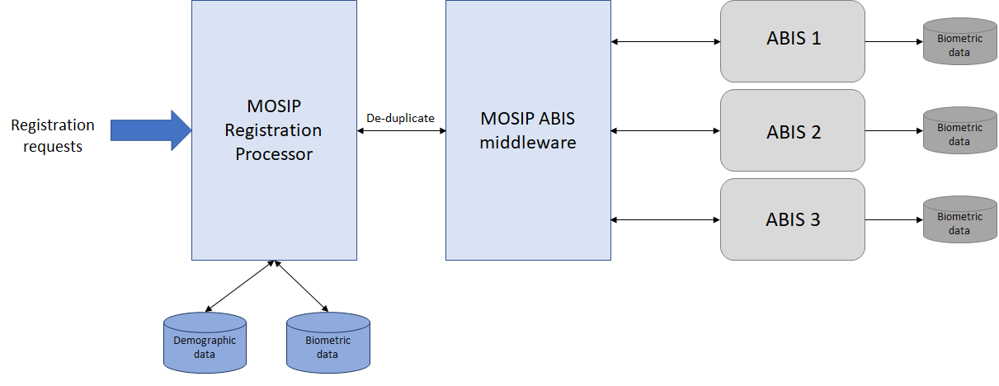

## Overview

Providing unique identity for a resident is one of key features of any identity platform. To achieve this, MOSIP interfaces with an Automated Biometric Identification System (ABIS) to perform de-duplication of a resident's biometric data. MOSIP is designed to integrate with multiple ABISs to leverage expertise of different ABIS providers. A country may use one ABIS for fingerprint and another for Iris or use multiple ABISs for the same biometric data and evaluate the best ABIS based on de-duplication quality. Note that ABIS is used for deduplication during registration, but not for authentication.

The ABIS system will never come to know about hte resident's identity. Any PII information such as demographic details of the resident or RID (Request ID for Registration) will be shared with the ABIS system. But, MOSIP maintains a mapping between the ABIS specific referenceID and RID of the resident.

## ABIS middleware
MOSIP's ABIS middleware has the following components
- MOSIP ABIS request handler 
- Request router (based on routing policy, an ABIS request is routed to the correct ABIS system)
- ABIS response handler

## ABIS interface
MOSIP interacts with ABIS only via message queues. JSON format is used for all control messages. Biometrics data is exchanged as per formats defined in [Biometric Data Specification](Biometric-Data-Specification.md). The biometric data is wrapped in [CBEFF XML](CBEFF-XML.md) and sent to ABIS.

ABIS must support the following types of biometric images
* Individual fingerprint images (segmented)
* IRIS images (left, right)
* Face photograph

ABIS must support  [ABIS APIs](ABIS-APIs.md).

## ABIS queue
ABIS queue can be configured in [RegistrationProcessorAbis-env.json](https://github.com/mosip/mosip-config/blob/master/config-templates/RegistrationProcessorAbis-env.json) file. MOSIP ABIS middleware communicates to ABIS through queues configured by sending requests to inbound queue address and receiving responses from outbound queue address.

## ABIS deployment
* It is recommended that the MOSIP adopters deploy ABIS on the same secure zone (military zone) where the registration processor is deployed. 
* ABIS system will connect to the queue using a pre-defined user id and password. 
* ABIS system is not recommended to connect to any external network.