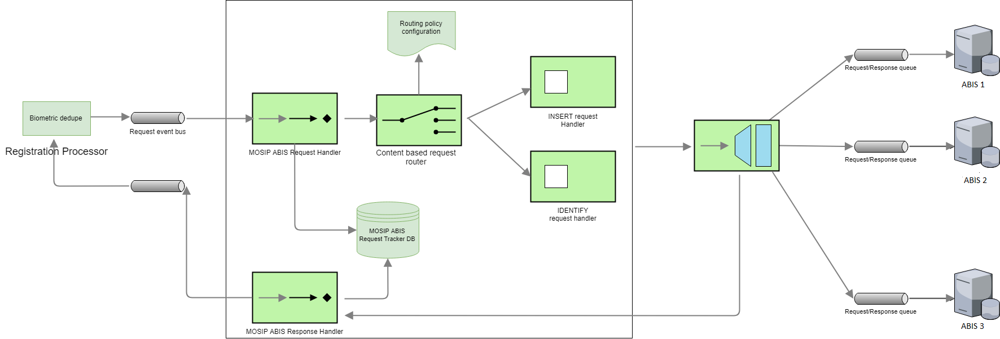

## Overview

Providing unique identity for an individual is one of key features of any identity platform.  To achieve this, MOSIP interfaces with **Automated Biometric Identification System (ABIS)** to de-duplicate an individual's biometric data. MOSIP is designed to integrate with multiple ABISs to leverage expertise of different ABIS providers. A country may use one ABIS for fingerprint and another for Iris or use multiple ABISs for the same biometric data and evaluate the best ABIS based on de-duplication quality.  Note that ABIS is used for deduplication during registration, but not for authentication.

**_Notes:_**
* It is recommended that the MOSIP adopters deploy ABIS on the same secure zone (military zone) where the registration processor runs. 
* ABIS system will connect to the queue using a pre-defined user id and password. 
* ABIS system is not recommended to connect to any external network. 
* ABIS system will never come to know about the resident’s identity. 
* No RID (Request ID for Registration) or any demographic information will get into the ABIS system. 
* MOSIP maintains a mapping between the ABIS specific referenceID and RID of a resident.

## MOSIP ABIS Middleware
MOSIP ABIS middleware has the following components
- MOSIP ABIS request handler 
- Request router (based on routing policy, an ABIS request is routed to the correct ABIS system)
- ABIS response handler

## MOSIP-ABIS interface
MOSIP interacts with ABIS only via message queues.  JSON format is used for all control messages.  Biometrics data is exchanged as per formats defined in [MDS Specification](MOSIP-Device-Service-Specification.md).  The biometric data is wrapped in [CBEFF XML](CBEFF-XML.md) and sent to ABIS.

ABIS must support the following types of biometric images
* Individual fingerprint images (segmented)
* IRIS images (left, right)
* Face photograph

ABIS must support  [ABIS APIs](ABIS-APIs.md).

### Configure ABIS queue
ABIS queue can be configured in [RegistrationProcessorAbis-env.json](https://github.com/mosip/mosip-config/blob/master/config-templates/RegistrationProcessorAbis-env.json) file. MOSIP ABIS middleware communicates to ABIS through queues configured by sending requests to inbound queue address and receiving responses from outbound queue address.
