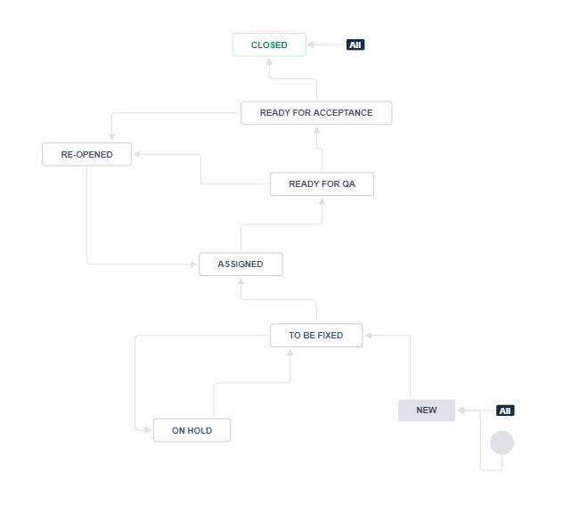

## Issues/Enhancements/Features Reporting Guideline

#### Reporting Issues 
1. Check if the issue is already reported.

1. Check if the issue is already fixed.

1. If not, just go and file the issue

1. Template for filing new issues

> **Describe the issue**
> A clear and concise description of what the bug is.

> **To Reproduce**
>Steps to reproduce the behavior:

>**Expected behavior**
>A clear and concise description of what you expected to happen.

>**Actual behavior**
>A clear and concise description of what you see.

>**Screenshots**
>If applicable, add screenshots to help explain your problem.

>**Environment (please complete the following information):**
> Hardware and software details such as client OS, Server OS, Browser details etc

>**Attach logs**
>Helps in faster resolution of data

>**Additional context**
>Add any other context about the problem here.

#### Issues Workflow
Status flow from the time an issue is reported till it is resolved and closed.

1. Any issue created will be in NEW status 
1. NEW issues are triaged and if deemed to be fixed, they are marked "TO BE FIXED".  If not, then are closed directly as CLOSED.
1. It may be decided to defer to fix the issue in which case the issue is marked as "ON HOLD" which would be re-triaged at a later date.
1. When a potential taker is identifie, the issue is ASSIGNED to the taker.
1. When the issue is fixed, it is marked as "READY FOR QA".  It indicates that the issue is ready for testing.
1. If the tests fail, the issue is RE-OPENED.  RE-OPENED issues can be reassigned to the same assignee or a different assignee.
1. If the tests pass, the issue is marked "READY FOR ACCEPTANCE".  This is an indication to the maintainer(s) to accept the fix.  The maintainer verifies the fix, reviews code, runs acceptance tests to check the fix.
1. The maintainer(s) would either reopen the bug if the fix is not satisfactory and mark the status as REOPENED or accept the fix.
1. One of the maintainer merges the accepted code with the master branch and marks the issue as CLOSED.

***

#### Features/Enhancement request guidelines

1. Check if the feature is already reported.

1. Check if the feature is already fixed.

1. If not, just go and file the feature request

1. Template for filing new feature request

> **What is the current limitation without the feature**

> **Describe the feature request**

> **What would the key benefits of this feature**

> **Do you have any recommendations and solutions that are existing in the field**

> **Any technology/solution recommendation would be highly appreciated**

