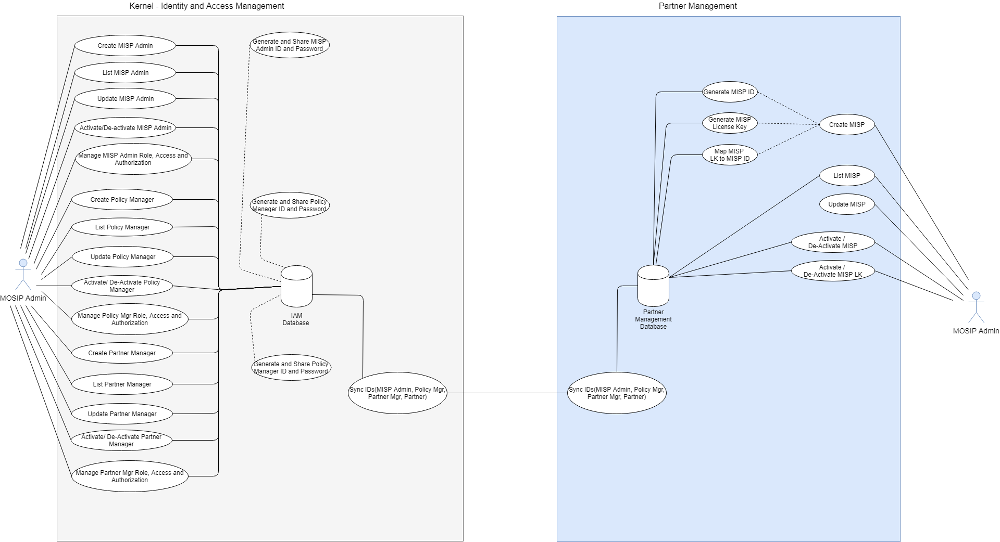
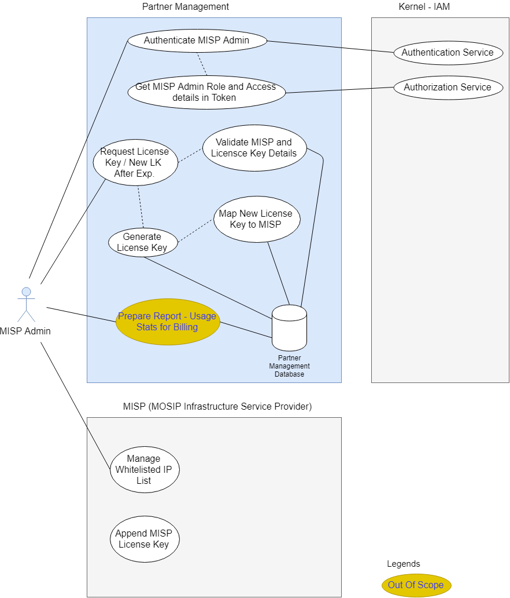
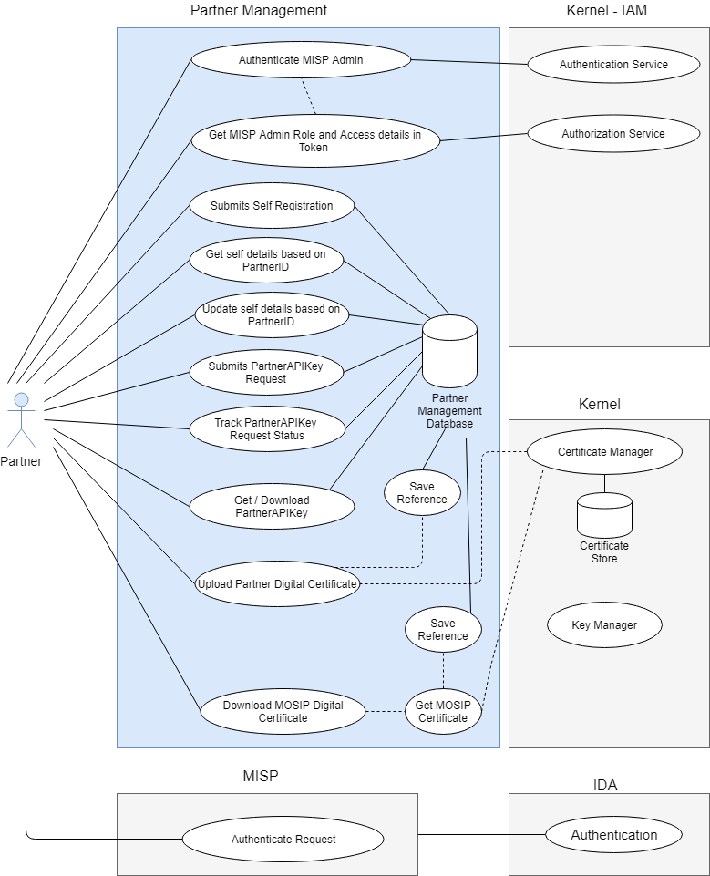
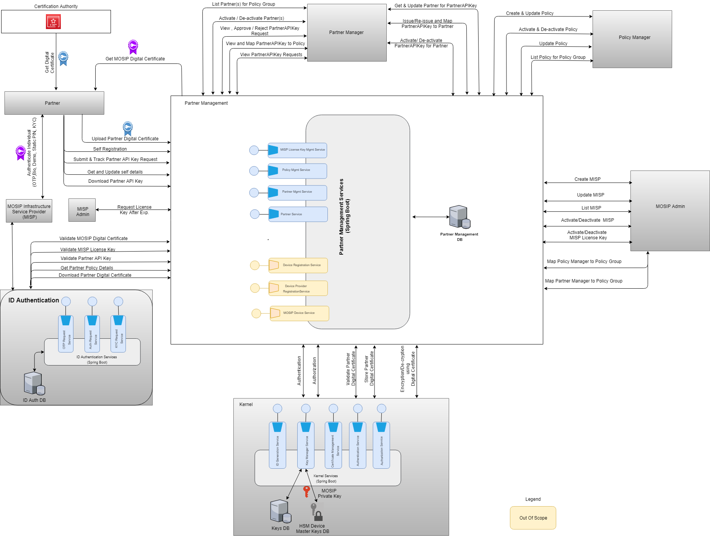

# Introduction

Partner Management provides services for Partner and MISP (MOSIP Infrastructure Service Provider) Registration and Authentication. Registered Partners and MISP are only allowed to access MOSIP Authentication services. Partners and MISP are registered using Partner Management Services.  Authentication services of MOSIP will internally use the Partner Management Services to authenticate Partner and MISP and validate if only the registered entities are accessing the services.

Partner Management also involves policy management for Partners. Each partner can access Authentication services only based on a defined policy. Authentication services of MOSIP will internally use the Partner Management Services to authenticate a partner based on the policy.

Partner Management also includes License Key Management services. Authentication Services of MOSIP will utilize Partner Management services for License key based authentication of a MISP Partners send authentication request and receive authentication responses in a secured setup. Public/Private keys are used for encryption/decryption/signing the request/response. Distribution of Public key to Partners and retrieval of Public key from partners is managed by Partner Management Services. 

Partners will utilize MOSIP’s resigned digital certificate from Partner Management Services for signing the authentication request.

# Detailed functionality 

[Parter Management Functionality](Partner-Management-Functionality)

# Entities and their relation 


# Components

## User Management



## MOSIP Infrastructure Service Provider (MISP) 



## Policy Manager


## Partner Manager


## Partners



## ID Authentication Services


## Policy
A Policy is an authentication type or set of authentication types that is utilized by partners to validate any individual's identity.

Authentication types:

1. Demographic:  based on individual's name, date of birth, gender, address details
1. OTP: based on mobile or email one time password (OTP) authentication
1. Biometric: based on finger, irs, face

After successful authentication, KYC response is sent back to Partner for the individual.

**Sample Master Policy JSON**

```json
{
    "policies": {
        "authPolicies": [
            {"authType": "otp","mandatory": true},
            {"authType": "demo","mandatory": false},
            {"authType": "bio","authSubType": "FINGER","mandatory": true},
            {"authType": "bio","authSubType": "IRIS","mandatory": false},
            {"authType": "bio","authSubType": "FACE","mandatory": false},
            {"authType": "kyc","mandatory": false}
                    
        ],
        "allowedKycAttributes": [  
            {"attributeName": "fullName","required": true},
            {"attributeName": "dateOfBirth","required": true},
            {"attributeName": "gender","required": true},
            {"attributeName": "phone","required": true},
            {"attributeName": "email","required": true},
            {"attributeName": "addressLine1","required": true},
            {"attributeName": "addressLine2","required": true},
            {"attributeName": "addressLine3","required": true},
            {"attributeName": "location1","required": true},
            {"attributeName": "location2","required": true},
            {"attributeName": "location3","required": true},
            {"attributeName": "postalCode","required": false},
            {"attributeName": "photo","required": true}
       ]
    }
}
```

## Policy Group

A Policy Group is a sector or domain like banking, insurance, telecom etc, specific to a country. Any policy manager, partner manager and partner can belong to a specific policy group.  MOSIP would require Policy Group master data prepared and defined beforehand by country, before creation of Partner, Partner Manager and Policy Manager.
 
## Policy Manager

Policy Manager would be creating and managing policies for the policy group he/she belongs to.
 
## PartnerAPIKey

For a partner to opt for an authentication policy, they have to generate PartnerAPIKey request with following sample parameters - PartnerCode, UseCaseDescription, SupportingInfo, Status etc. Once the PartnerAPIKey request is approved by Partner Manager, Partner is provided PartnerAPIKey that contains details like - PartnerAPIKey (combination of PartnerCode, policy group and policy), issuedOn, validTill, isActive etc)

## Logical View



# Secure communication

[MOSIP Partner Secure Communication](MOSIP-Partner-Secure-Communication)

# Services

For detailed description of Partner Management Services, high and low level design refer to [partner management repo](https://github.com/mosip/mosip-partner-portal-api).

# Build and deploy
Refer to build and deploy instructions in [partner management repo](https://github.com/mosip/mosip-partner-portal-api)

# APIs
[Partner Management](Partner-Management-Service-APIs)


